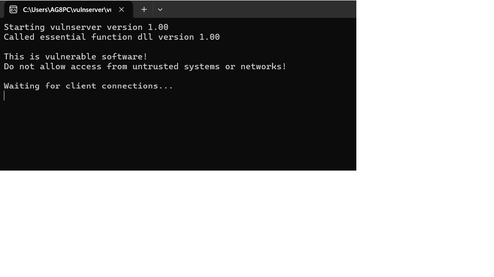
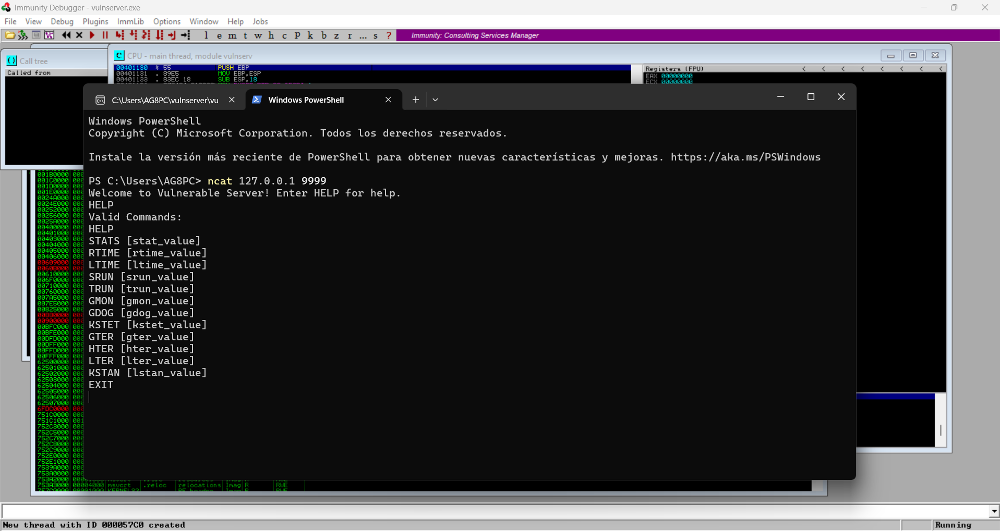

# Aplicaciones vulnerables

Para poder practicar técnicas de análisis y explotación es necesario trabajar con aplicaciones diseñadas específicamente para contener vulnerabilidades.

Este tipo de aplicaciones permiten reproducir escenarios reales donde un atacante puede enviar datos maliciosos a un servicio vulnerable y analizar cómo responde el programa.

Durante el laboratorio se utilizaron las siguientes aplicaciones.

## VulnServer

VulnServer es una aplicación vulnerable ampliamente utilizada en laboratorios de seguridad ofensiva.

Se trata de un servidor que escucha conexiones de red y permite enviar diferentes comandos al servicio. Algunos de estos comandos contienen vulnerabilidades intencionadas que permiten estudiar técnicas de explotación.

Entre sus características destacan:

- Recepción de comandos a través de red
- Posibilidad de enviar grandes cantidades de datos
- Vulnerabilidades diseñadas para prácticas de explotación

VulnServer se utiliza habitualmente para aprender técnicas como:

- Buffer overflows
- Análisis de memoria
- Control del flujo de ejecución
- Desarrollo de exploits

### Ejecución de VulnServer

La siguiente imagen muestra el servidor vulnerable VulnServer en ejecución dentro del entorno de laboratorio.

El servidor queda a la espera de conexiones entrantes, lo que permite interactuar con él mediante herramientas de red o scripts desarrollados para el análisis de vulnerabilidades.

Figura 1: VulnServer ejecutándose en el entorno de laboratorio.

### Enumeración de comandos en VulnServer

Una vez establecida la conexión con el servidor vulnerable mediante herramientas de red como Ncat, es posible consultar los comandos disponibles utilizando el comando `HELP`.

Este comando permite identificar las diferentes funcionalidades que ofrece el servicio, lo que resulta útil durante la fase de reconocimiento del sistema.

Analizar los comandos disponibles permite identificar posibles puntos de entrada donde podrían existir vulnerabilidades explotables.

Figura 4: Enumeración de comandos disponibles en VulnServer mediante el comando HELP.

## FreeFloat FTP Server

FreeFloat FTP Server es un servidor FTP vulnerable utilizado para practicar el análisis de vulnerabilidades en servicios de red.

Este tipo de aplicaciones permiten estudiar cómo un servicio puede comportarse de forma incorrecta cuando recibe datos maliciosos enviados por un usuario.

El análisis de este tipo de servidores permite comprender cómo los errores en la validación de datos pueden derivar en vulnerabilidades explotables.
