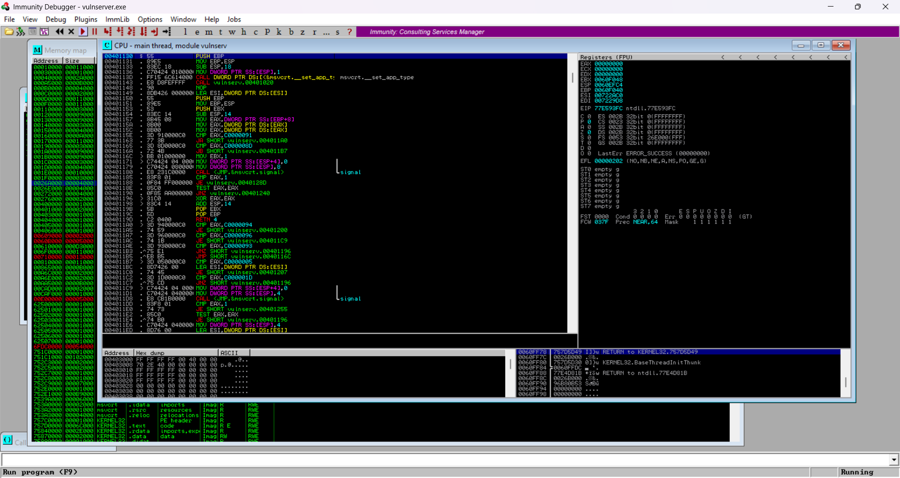

# Debuggers y herramientas de reversing

El análisis de vulnerabilidades requiere comprender cómo funciona una aplicación internamente. Para ello se utilizan herramientas de **debugging** y **reversing**, que permiten observar el comportamiento del programa durante su ejecución y analizar su código a bajo nivel.

Estas herramientas permiten estudiar cómo se gestionan los datos en memoria, cómo se ejecutan las instrucciones del programa y qué ocurre cuando se introduce una entrada inesperada o maliciosa.

## Ghidra

Ghidra es una herramienta de ingeniería inversa desarrollada por la NSA y publicada como software de código abierto.

Permite realizar análisis estático de aplicaciones compiladas, desensamblar el código y generar representaciones del flujo de ejecución del programa.

Entre sus funcionalidades destacan:

- Desensamblado de binarios
- Análisis de funciones
- Visualización del flujo de ejecución
- Identificación de estructuras de datos

Ghidra es ampliamente utilizada en el análisis de malware y en la investigación de vulnerabilidades.

## IDA

IDA (Interactive Disassembler) es otra herramienta muy utilizada en el ámbito de la ingeniería inversa.

Permite analizar aplicaciones compiladas y observar las instrucciones de bajo nivel que componen el programa.

Esta herramienta facilita el estudio detallado del comportamiento interno de una aplicación, lo que resulta especialmente útil durante el análisis de vulnerabilidades complejas.

## Immunity Debugger

Immunity Debugger es una herramienta diseñada para analizar aplicaciones durante su ejecución.

Permite observar en tiempo real el estado de los registros, la memoria y el stack del programa. Esto resulta fundamental cuando se analiza una vulnerabilidad relacionada con corrupción de memoria, ya que permite comprobar cómo una entrada maliciosa afecta al flujo de ejecución del programa.

Además, Immunity Debugger permite utilizar plugins como **Mona**, que facilitan el proceso de desarrollo de exploits.

### Análisis de VulnServer con Immunity Debugger

La siguiente imagen muestra el servidor vulnerable **VulnServer** cargado dentro de Immunity Debugger.

El uso de un debugger permite observar en tiempo real el comportamiento interno del programa, incluyendo el flujo de ejecución de las instrucciones, el estado de los registros y el contenido de la memoria.

Este tipo de herramientas resulta fundamental durante el análisis de vulnerabilidades, ya que permite identificar cómo una entrada maliciosa puede afectar al flujo de ejecución del programa.

Figura 3: VulnServer cargado dentro de Immunity Debugger para su análisis.

