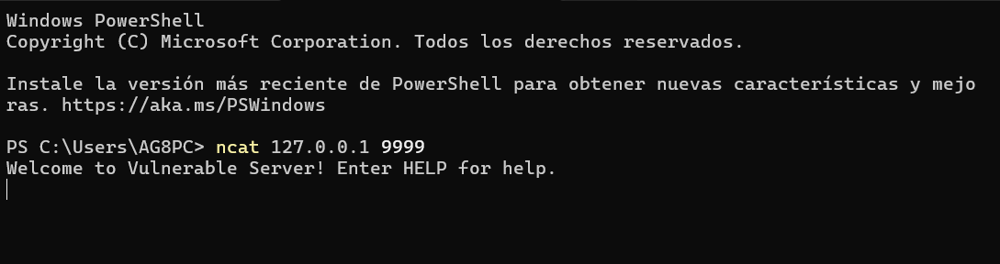

# Herramientas de red

Durante el proceso de análisis de vulnerabilidades es frecuente interactuar con servicios que reciben datos a través de la red. Para ello es necesario utilizar herramientas que permitan conectarse a estos servicios y enviar datos manualmente.

En este laboratorio se utilizaron herramientas de análisis de red incluidas dentro de la suite Nmap.

## Nmap

Nmap es una herramienta ampliamente utilizada en seguridad informática para el análisis de redes.

Permite descubrir hosts activos dentro de una red, identificar puertos abiertos y detectar los servicios que se están ejecutando en un sistema.

Entre sus principales funcionalidades destacan:

- Escaneo de puertos
- Identificación de servicios
- Detección de versiones
- Análisis de redes

## Ncat

Ncat es una herramienta incluida dentro de la suite Nmap que permite establecer conexiones directas con servicios de red.

Su funcionamiento es similar al de herramientas como netcat, permitiendo enviar y recibir datos a través de una conexión TCP o UDP.

Durante el laboratorio se utilizó Ncat para conectarse a servicios vulnerables como VulnServer y enviar datos manualmente con el objetivo de analizar el comportamiento del programa frente a diferentes entradas.

### Conexión al servidor vulnerable

Una vez que el servidor VulnServer se encuentra en ejecución, es posible interactuar con él utilizando herramientas de red como Ncat.

Mediante este tipo de herramientas se pueden enviar comandos manualmente al servicio, lo que permite analizar cómo responde la aplicación ante diferentes entradas.

Figura 2: Conexión al servidor VulnServer utilizando Ncat.

